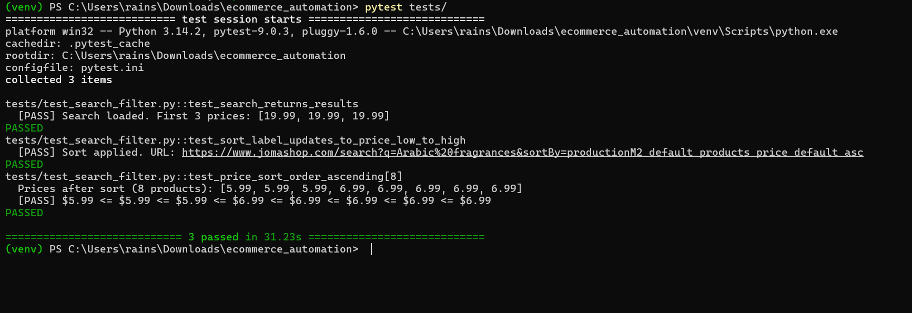

# Urban Routes — QA Engineering Portfolio

**Program:** TripleTen QA Engineering Apprenticeship
**Project:** Urban Routes & Urban Lunch — Ride-Hailing & Food Delivery Applications
**Author:** Efrain Solivan | [LinkedIn](https://www.linkedin.com/in/efrain-solivan)
**Progress:** Sprints 1–8 in progress (89% of program)

---

## About This Repository

This repo documents all QA work completed in the TripleTen QA Engineering program. Each sprint has its own folder with a detailed README, links to live project artifacts (Google Sheets, Jira), and relevant code files.

> ⚠️ **Note:** All testing was conducted in the TripleTen sandbox environment. This does not represent work in a production environment or at a real company.
>
> ## 🌟 Featured: Production UI Automation
**Project:** Live E-Commerce Logic Validation (Jomashop)  
**Status:** 🚀 [Complete & Verified](./ecommerce_automation/)

Unlike sandbox projects, this framework was built to handle a live production environment.
* **Tech:** Python, Pytest, Selenium, Undetected-Chromedriver.
* **Challenge:** Overcoming anti-bot measures and dynamic DOM elements to validate search and sorting logic.
* **Outcome:** Successfully automated a sequence that verifies price-sorting accuracy across 10+ live items.


>
>  ---
>
> ## Sprint Index
>
> | Sprint | Topic | Project | Artifact | Status |
> |--------|-------|---------|----------|--------|
> | Sprint 1 | Testing Fundamentals | Manual testing & bug reporting — Urban Routes map UI | 📋 Jira Board ESP1 | ✅ Accepted |
> | Sprint 2 | Test Design & Documentation | Address field test design (EC/BV, test cases) | 📊 Google Sheets | ✅ Accepted |
> | Sprint 3 | Testing Web Applications | Payment card validation (EC/BV, test cases) | 📊 Google Sheets | ✅ Accepted |
> | Sprint 4 | APIs | REST API testing — Kits & Fast Delivery endpoints | 📊 Google Sheets · 📬 Postman | ✅ Accepted |
> | Sprint 5 | Understanding Databases | SQL — Urban Routes data integrity validation (supplemental; auto-graded portion not in repo) | 🗄️ [SQL file](sql/urban_routes_data_integrity.sql) | ✅ Complete |
> | Sprint 6 | Testing Mobile Applications | Mobile checklist — Urban Lunch Android app | 📊 Google Sheets | ✅ Accepted |
> | Sprint 7 | Python | (in progress) | — | 🔄 In Progress |
> | Sprint 8 | Browser Automation | Selenium WebDriver full order flow | 🤖 [Selenium](selenium/test_urban_routes.py) | ✅ Complete |
> | Sprint 9 | Final Project | Applied Testing — capstone | — | ⏳ Upcoming |
>
> ---
>
> ## Repository Structure
>
> ```
> TripleTen-QA-projects-ES/
> │
> ├── selenium/
> │   ├── conftest.py              ← Shared pytest fixtures (driver, open_url)
> │   └── test_urban_routes.py    ← Sprint 8 Selenium tests
> │
> ├── sprint-1/  ← Manual testing & Jira bug reports
> │   └── README.md
> │
> ├── sprint-2/  ← Test design: address fields (Google Sheets)
> │   └── README.md
> │
> ├── sprint-3/  ← Test design: card validation (Google Sheets)
> │   └── README.md
> │
> ├── sprint-4/  ← API testing: kits & fast delivery (Sheets + Postman)
> │   └── README.md
> │
> ├── sprint-5/  ← SQL: database understanding sprint
> │   └── README.md
> │
> ├── sprint-6/  ← Mobile testing checklist (Google Sheets)
> │   └── README.md
> │
> ├── postman/
> │   └── urban_routes_api_collection.json  ← Sprint 4 Postman collection
> │
> ├── sql/
> │   └── urban_routes_data_integrity.sql  ← Urban Routes integrity queries (Sprint 5 supplemental)
> │
> ├── test-cases/
> │   └── urban_routes_test_cases.md  ← Manual test cases (all sprints)
> │
> ├── .gitignore
> ├── requirements.txt              ← Python dependencies (selenium, pytest)
> └── README.md
> ```
>
> ---
>
> ## Tech Stack
>
> | Area | Tools |
> |------|-------|
> | Manual Testing | Jira, test case templates, exploratory testing |
> | Test Design | Equivalence classes, boundary value analysis, Google Sheets |
> | API Testing | Postman (REST: GET/POST, status codes, response schema) |
> | Database | PostgreSQL / SQL (JOINs, aggregates, CASE WHEN, subqueries) |
> | Mobile Testing | Android Studio Emulator, Android app testing |
> | UI Automation | Python, Pytest, Selenium WebDriver, ChromeDriver, Page Object Model |
> | Defect Tracking | Jira (project ESP1, ESP3) |
>
> ---
>
> ## Defect Summary (All Sprints)
>
> | Category | Total | Critical | High | Medium | Low |
> |----------|-------|----------|------|--------|-----|
> | Map & Address UI (S1) | 10 | 0 | 1 | 5 | 4 |
> | Card Validation (S3) | 10 | 1 | 8 | 1 | 0 |
> | API — Kits (S4) | 11 | 0 | 10 | 1 | 0 |
> | API — Fast Delivery (S4) | 3 | 1 | 2 | 0 | 0 |
> | Mobile — Urban Lunch (S6) | 6 | 1 | 3 | 2 | 0 |
> | **Total** | **40** | **3** | **24** | **9** | **4** |
>
> Each sprint folder contains a full project README with tools used, what was tested, key findings, and links to all artifacts.
